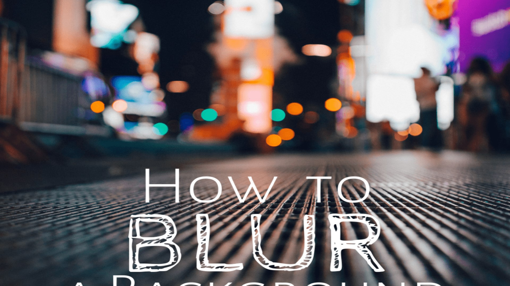

# new
#<!DOCTYPE html>
#<html lang="en">

#<head>
    <meta charset="UTF-8">
    <meta http-equiv="X-UA-Compatible" content="IE=edge">
    <meta name="viewport" content="width=device-width, initial-scale=1.0">
    <link rel="stylesheet" href="./font-awesome.min.css">
    <link rel="stylesheet" href="./normalize.css">
    <link rel="stylesheet" href="./SpecialDesign.css">
    <link rel="preconnect" href="https://fonts.googleapis.com">
    <link rel="preconnect" href="https://fonts.gstatic.com" crossorigin>
    <link href="https://fonts.googleapis.com/css2?family=Open+Sans:wght@300;400;700&display=swap" rel="stylesheet">

    <title>Special Design</title>
</head>

<body>

    <!-- Start Setting Box -->

    

        

            <i class="fa fa-gear sett"></i>
        

        

            

                <h4 style="font-size: 25px;">Colors</h4>
                <ul class="colors-list">
                    <li class="active" data-color="#FF9800"></li>
                    <li data-color="#E91E63"></li>
                    <li data-color="#009688"></li>
                    <li data-color="#03A9F4"></li>
                    <li data-color="#4CAF50"></li>
                </ul>
            

            

                <h4> Random Backgrounds </h4>
                

                    Yes
                    No
                

            

            

                <h4>Choose Background</h4>
                

                    
                    
                    
                    
                    
                    
                

            

            

                <h4>Show Bullets</h4>
                

                    Yes
                    No
                

            

            <button class="reset-option">Reset Options</button>
        

    

    <!-- End Setting Box -->

    <!-- Start NAV Bullets -->

    

        

            
End

        

        

            
About US

        

        

            
Our Skills

        

        

            
Our Gallery

        

        

            
Timeline

        

        

            
Top

        

    

    <!-- End NAV Bullets -->

    <!-- Start Landing page -->

    

        

        

            

                

                

                    <ul class="links">
                        <li> <a href="#" data-section=".about-us">About US</a> </li>
                        <li> <a href="#" data-section=".skills">Skills</a> </li>
                        <li> <a href="#" data-section=".gallery">Gallery</a> </li>
                        <li> <a href="#" data-section=".timeline">Timeline</a> </li>
                        <li> <a href="#" data-section=".features">Features</a> </li>
                        <li> <a href="#" data-section=".testimonials">Testimonials</a> </li>
                    </ul>
                    <button class="toggle-menu">
                        
                        
                        
                    </button>
                

            

        

        

            <h1> We are  Creative  Agency </h1>
            
 Lorem ipsum dolor sit, amet consectetur adipisicing elit. Nostrum ipsum dolor sit amet consectetur
                adipisicing elit. Ad, enim Quod?
            

        

    

    <!-- End Landing page  1920*1080 -->

    <!-- Start Our Skills -->

    

        

            <h2>Our Skills</h2>
            

                
HTML

                

                    
                

            

            

                
CSS

                

                    
                

            

            

                
JavaScript

                

                    
                

            

            

                
Python

                

                    
                

            

            

                
PHP

                

                    
                

            

            

                
MySQL

                

                    
                

            

        

    

    <!-- Start Our Skills -->

    <!-- Start Testimonials -->

    

        

            <h2>Testimonials</h2>
            

                
Lorem ipsum dolor sit amet consectetur adipisicing elit. Excepturi porro hic explicabo atque unde
                    optio, minima quos

                

                    
                    <h4>Mario Shawky</h4>
                    
CEO at Company

                

            

            

                
Lorem ipsum dolor sit amet consectetur adipisicing elit. Excepturi porro hic explicabo atque unde
                    optio, minima quos

                

                    
                    <h4>Mario Shawky</h4>
                    
CEO at Company

                

            

            

                
Lorem ipsum dolor sit amet consectetur adipisicing elit. Excepturi porro hic explicabo atque unde
                    optio, minima quos

                

                    
                    <h4>Mario Shawky</h4>
                    
CEO at Company

                

            

        

        

    

    <!-- End Testimonials -->

    <!-- Start Our Gallery -->

    

        

            <h2>Our Gallery</h2>
            

                
                
                
                
                
                
                
                
                
                
                
                
                
                
                
            

        

    

    <!-- End Our Gallery -->

    <!-- Start Time Line -->

    

        

            

                
2018

                

                    

                        <h3>Testing Heading</h3>
                        
Lorem ipsum dolor sit amet consectetur adipisicing elit. Perferendis fuga adipisci unde
                            facere iste aliquid hic modi recusandae sunt, neque impedit sapiente aperiam suscipit, cum,
                            sint voluptatum. Quam, rem repudiandae.

                    

                

                

                

                    

                        <h3>Testing Heading</h3>
                        
Lorem ipsum dolor sit amet consectetur adipisicing elit. Perferendis fuga adipisci unde
                            facere iste aliquid hic modi recusandae sunt, neque impedit sapiente aperiam suscipit, cum,
                            sint voluptatum. Quam, rem repudiandae.

                    

                

                

                
2016

                

                    

                        <h3>Testing Heading</h3>
                        
Lorem ipsum dolor sit amet consectetur adipisicing elit. Perferendis fuga adipisci unde
                            facere iste aliquid hic modi recusandae sunt, neque impedit sapiente aperiam suscipit, cum,
                            sint voluptatum. Quam, rem repudiandae.

                    

                

                

                

                    

                        <h3>Testing Heading</h3>
                        
Lorem ipsum dolor sit amet consectetur adipisicing elit. Perferendis fuga adipisci unde
                            facere iste aliquid hic modi recusandae sunt, neque impedit sapiente aperiam suscipit, cum,
                            sint voluptatum. Quam, rem repudiandae.

                    

                

                

            

        

    

    <!-- End Time Line -->

    <!-- Start Features -->

    

        

        <h2>Our Features</h2>
        

            

                
                <h4>Development</h4>
                
Lorem ipsum dolor sit amet consectetur adipisicing elit. Voluptatibus sunt, vero minima, consequatur
                    fugiat est ex deserunt illo facilis, amet nam! Dolor omnis, vero veniam cum magni accusantium iure
                    maiores.

            

            

                
                <h4>Development</h4>
                
Lorem ipsum dolor sit amet consectetur adipisicing elit. Voluptatibus sunt, vero minima, consequatur
                    fugiat est ex deserunt illo facilis, amet nam! Dolor omnis, vero veniam cum magni accusantium iure
                    maiores.

            

            

                
                <h4>Development</h4>
                
Lorem ipsum dolor sit amet consectetur adipisicing elit. Voluptatibus sunt, vero minima, consequatur
                    fugiat est ex deserunt illo facilis, amet nam! Dolor omnis, vero veniam cum magni accusantium iure
                    maiores.

            

            

                
                <h4>Development</h4>
                
Lorem ipsum dolor sit amet consectetur adipisicing elit. Voluptatibus sunt, vero minima, consequatur
                    fugiat est ex deserunt illo facilis, amet nam! Dolor omnis, vero veniam cum magni accusantium iure
                    maiores.

            

            

                
                <h4>Development</h4>
                
Lorem ipsum dolor sit amet consectetur adipisicing elit. Voluptatibus sunt, vero minima, consequatur
                    fugiat est ex deserunt illo facilis, amet nam! Dolor omnis, vero veniam cum magni accusantium iure
                    maiores.

            

            

                
                <h4>Development</h4>
                
Lorem ipsum dolor sit amet consectetur adipisicing elit. Voluptatibus sunt, vero minima, consequatur
                    fugiat est ex deserunt illo facilis, amet nam! Dolor omnis, vero veniam cum magni accusantium iure
                    maiores.

            

            

        

    

    <!-- End Features -->

    <!-- Start About Us -->
    

        

            

                <h2>About Us</h2>
                
Lorem ipsum dolor sit amet consectetur adipisicing elit. Numquam id dolore cum ipsam neque accusamus
                    pariatur nam explicabo. Aperiam laudantium deleniti accusantium ea? Eius quidem deleniti sit neque
                    provident corporis.

            

            

                
            

        

    

    <!-- End About Us -->

    <!-- Start Contact Us -->

    

        

        

            <h2>Contact US</h2>
            <form action="">
                

                    <input type="text" placeholder="Your Name" name="username">
                    <input type="text" placeholder="Your Phone" name="phone">
                    <input type="email" placeholder="Your Email" name="email">
                    <input type="text" placeholder="Subject" name="subject">
                

                

                    <textarea name="message" placeholder="Your Message"></textarea>
                    <input type="submit" value="send">
                

            </form>
        

    

    <!-- End Contact Us -->

    <!-- Start Footer -->

    
Created By Mero SH

    <!-- End Footer -->

    
</body>

</html>
